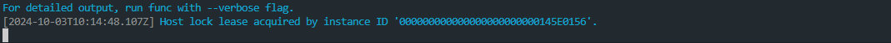

# Challenge 04: AutoFlow: Streamlining Processes with Azure Functions

**Expected Duration:** 90 minutes

## Introduction
Your goal in this challenge is to create and deploy an Azure Function written in Python that will automate the processing of the different data files. 
You will deploy the required resources in Azure, including the Azure Function, and set up the development environment. By completing this challenge, you will have a fully functional serverless function ready for further development.

## Introduction to Azure Functions

 <span style="font-size:14px; font-weight:bold;">Azure Functions

[Azure Functions](https://azure.microsoft.com/en-us/products/functions/?msockid=3b33a8ae1caf6af23334bc5b1dc86b9e) is a cloud service available on-demand that provides all the continually updated infrastructure and resources needed to run your applications. You focus on the code that matters most to you, in the most productive language for you, and Functions handles the rest. Functions provides serverless compute for Azure. You can use Functions to build web APIs, respond to database changes, process IoT streams, manage message queues, and more.

## Configuring Environment Variables

### Create a local.settings.json file

The `local.settings.json` file is a configuration file that contains the environment variables for the application. Create a `local.settings.json` in the `az-function` folder and replace the values below with the endpoints/keys generated in Challenge 1.

**Note: For development and testing purposes `AzureWebJobsStorage` and `STORAGE_CONNECTION_STRING` should use the same same Azure Storage connection string. In a production scenario this should be separate storage accounts.**

```json
{
  "IsEncrypted": false,
  "Values": {
    "AzureWebJobsStorage": "",
    "FUNCTIONS_WORKER_RUNTIME": "python",
    "DOCUMENTINTELLIGENCE_ENDPOINT": "",
    "DOCUMENTINTELLIGENCE_API_KEY": "",
    "STORAGE_CONNECTION_STRING": "",
    "COSMOS_CONNECTION_STRING" : "",
    "AZURE_OPENAI_ENDPOINT" : "",
    "AZURE_OPENAI_KEY" : "",
    "AZURE_OPENAI_MODEL" : "gpt-4o"
  }
}
```

## Running the Azure Function Locally

To run the Azure Function locally, you need to install the Azure Functions Core Tools. The Azure Functions Core Tools provide a local development experience for creating, developing, testing, running, and debugging Azure Functions.

This should already be installed in your GitHub Codespaces.

To start the Azure Function, navigate to the `az-function` folder run the following command in the terminal:

NOTE: Azure Functions Core Tools requires Python 3.9 to 3.11. Python 3.12 is not supported.

The CodeSpaces environment should have all the required packages installed. So creating a python virtual environment is optional.

```bash
# OPTIONAL - Create a virtual environment using VS Code
# 1. Open the command palette (Ctrl + Shift + P)
# 2. Type Python: Create Virtual Environment
# 3. Select Venv
# 4. Select Python 3.9 or any version between 3.9 and 3.11
# 5. Select Challenge4/az-function/requirements.txt to install the required packages
# 6. Check if the virtual environment folder was created in the root of the repository (.venv folder)
# 7. Relaunch the terminal

# Navigate to the az-function folder
cd Challenge4/az-function

# Start the Azure Function
func host start
```

Ensure the folder structure is as follows in the Azure Storage Account:

```bash
data/loanagreements
data/loanforms
data/paystubs
```

Upload the sample data files to the respective containers in the Azure Storage Account.

You should now see the Azure Function running locally and processing the data files as they are uploaded to the containers in the Azure Storage Account.

## Resource Deployment Guide

### VS Code

Using the Azure Functions extension in VS Code, you can deploy your Azure Function to Azure.

1. Open the command palette (Ctrl + Shift + P)
2. Type `Azure Functions: Upload Local Settings`
3. Select the Function App you created in Challenge 1.
4. Right-click on the `az-function` folder.
5. Select `Deploy to Function App`.
6. Select the Function App you created in Challenge 1.

### Azure CLI

1. Navigate to the `az-function` folder.
2. Run the following commands to deploy the Azure Function to Azure.
```bash
az login
az account set --subscription <subscription_id_where_function_exists>
func azure functionapp publish <function_app_name> --publish-local-settings
```

## Testing your function locally

If you don't have the function running, navigate to the function folder and start it again:

```bash
# Navigate to the az-function folder
cd Challenge4/az-function

# Start the Azure Function
func host start
```

You should see a message such as this:



If no other errors were prompted, this means your function is ready to be triggered. So now, let's add some files to trigger our function. Inside this very folder you will find a folder called `testing-data` that contains 3 files too be added to the specific container inside the Storage Account. Therefore, let's open two tabs:
- `Storage Account`: where the data is inputed
- `Cosmos DB`: where the data will be outputed

And now, spend the next few minutes processing the testing data and check how it is loaded into the Cosmos DB.

## Create web application for document upload (optional)

Create a web application that allows users to upload documents to the Azure Blob Storage. The web application should have a form that allows users to select the document type and upload the document. The uploaded document should be stored in the Azure Blob Storage in the respective container based on the document type.

**NOTE:** This challenge is optional. If you want to learn more about developing web applications, you can follow the [documentation](https://docs.microsoft.com/en-us/azure/storage/blobs/storage-quickstart-blobs-python) and create a web application that allows users to upload documents to the Azure Blob Storage. Hint - You can also leverage the help of [GitHub Copilot](https://copilot.github.com/) or [Microsoft Copilot](https://copilot.microsoft.com) to generate the required source code and you can use the challenge description above as a prompt for GitHub Copilot and tune it if necessary.

## Extend Azure Function to process new document type (optional)

Add new document type created in [Challenge3](../Challenge3/readme.md) to the Azure Function. You can use the existing code as a reference and add required source code to automatically process new documents.

**NOTE:** This challenge is optional. If you want to learn more about developing Azure Functions, you can follow the [documentation](https://learn.microsoft.com/en-us/azure/azure-functions/functions-bindings-storage-blob-trigger?tabs=python-v2%2Cisolated-process%2Cnodejs-v4%2Cextensionv5&pivots=programming-language-python) and add required source code to [az-function/function_app.py](az-function/function_app.py) to process new document types. Inspiration could be also how existing document types are processed within Azure Function.

## Conclusion
In this challenge, you learned how to create and deploy an Azure Function using Python to automate the processing of various data files. You set up the necessary resources in Azure, including the Azure Function, and configured the development environment. You also learned how to run the Azure Function locally using the Azure Functions Core Tools and how to deploy it to Azure using both VS Code and the Azure CLI. Additionally, you explored how to structure your data in the Azure Storage Account and tested the function to ensure it processes data files correctly. 
