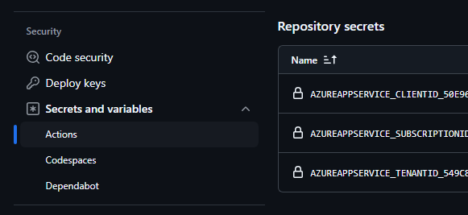

# Challenge 05: Set up CI/CD for Azure Function

**Expected Duration:** 30 minutes

## Introduction
Your goal in this challenge is to set up a CI/CD pipeline for the Azure Function created in Challenge 4. You will use GitHub Actions to automate the deployment of the Azure Function to the Azure Function App.
By completing this challenge, you will have a fully automated deployment process for the Azure Function.

## Setting up CI/CD for Azure Function

1. Navigate to the Azure Portal and open the Azure Function App created in Challenge 1.
2. Validate that all the necessary Environment variables are set in the Azure Function App. They should be the same as the ones set in the local.settings.json file, which we uploaded to the Azure Function App in Challenge 4.
2. Click on the deployment center and select the source control option, in our case it should be GitHub.
3. Authorize the connection between Azure and GitHub.
4. Select the repository and branch that contains the Azure Function code. (should be your Fork and the branch you're currently using)
5. Select Add a workflow.
6. Select User-assigned identity as the authentication method.
7. Select the User-assigned identity created in Challenge 1.
8. Preview the file, close and click Save.

At this point, you should have a GitHub Action workflow file in your repository. This file will be triggered every time you push changes to your repository. The workflow will build and deploy the Azure Function to the Azure Function App.

You should have as well the necessary secrets added to your repository automatically to authenticate the deployment to Azure.



Now before you push any new changes to the repository to trigger the workflow, you need to update the GH YAML file with the path to the Azure Function code. By default, the path is set to the repository root which is not our case.

Update the `AZURE_FUNCTIONAPP_PACKAGE_PATH` variable in the YAML file with the path to the Azure Function code in your repository which should be `Challenge4/az-function`.
```yaml
env:
  AZURE_FUNCTIONAPP_PACKAGE_PATH: '.' # set this to the path to your web app project, defaults to the repository root
  PYTHON_VERSION: '3.11' # set this to the python version to use (supports 3.6, 3.7, 3.8)
```

Push some test changes to the repository and check the GitHub Actions tab to see the workflow running.

## Conclusion
In this challenge, you learned how to set up Continuous Integration and Continuous Deployment (CI/CD) for an Azure Function using GitHub Actions. You navigated through the Azure Portal to validate environment variables and configured the deployment center to connect with GitHub. You authorized the connection, selected the appropriate repository and branch, and added a workflow using a user-assigned identity for authentication. By following these steps, you created a GitHub Action workflow file that triggers on every push to your repository, automating the build and deployment of your Azure Function. Additionally, you ensured that the necessary secrets were added to your repository for seamless authentication during deployment.
